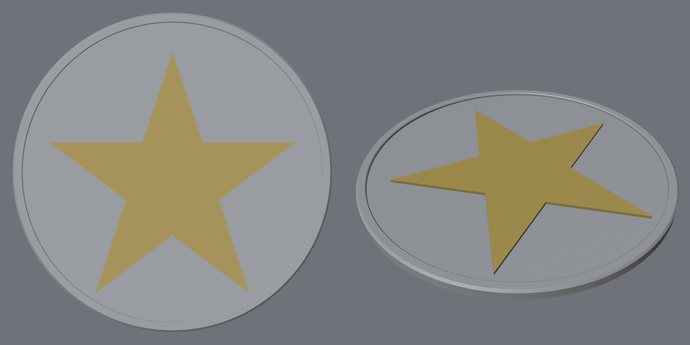
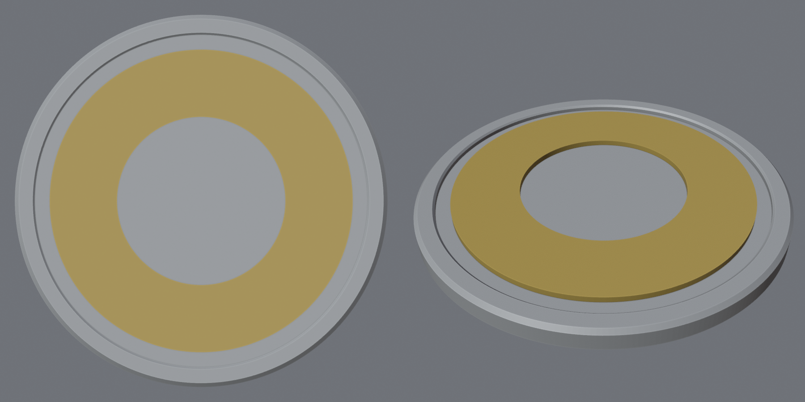
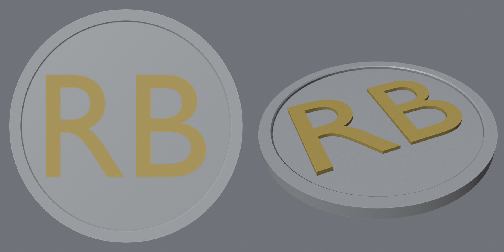

# Parametric Car Badge Generator

A headless Blender tool that turns an SVG or a text string into a 3D-printable circular car badge. Every dimension comes from a TOML config, so one command rebuilds the badge at any size. It writes single-body and two-color split STLs plus a preview render.

I built it to replace the front grille and rear tailgate emblems on a 2012 VW Jetta SportWagen with my own artwork.



| Ring-with-hole emblem (rear config) | Text monogram on a domed field |
|---|---|
|  |  |

*The emblems shown are original test shapes. Supply your own artwork.*

## Features

- **SVG or text emblems.** Holes (letter counters, rings) are kept. Emblems are fitted to the space inside the ring whatever the SVG's units, rotation or offset.
- **Printable output.** Every body is checked for manifold geometry, and the run fails if any check fails. A separate pure-Python checker then re-verifies the exported STL files.
- **Two-color ready.** The base and emblem STLs share one coordinate frame and touch without overlapping, so they drop straight into a multi-material slicer.
- **Edge styles:** flat, chamfer or dome, with a raised ring flush to the edge.
- **Mounting:** a recess on the flat back for adhesive tape, locating pins, or neither.
- **Validation first.** Every config error is reported at once, before any geometry is built.

## Requirements

- [Blender](https://www.blender.org/download/) 4.2 LTS or newer (developed on 5.2.2). The tool runs on Blender's bundled Python, so there are no other dependencies.
- `make` (optional)

```bash
brew install --cask blender   # macOS; puts `blender` on PATH
```

## Usage

```bash
blender -b -P badge_gen.py -- --config configs/front.toml
```

| Command | What it does |
|---|---|
| `make front` / `make rear` / `make text` | Build one of the shipped configs |
| `make all` | Build all three |
| `make test` | Unit + geometry tests, then build every config and verify every STL |
| `make check` | Verify the STLs already in `out/` |
| `make docs` | Rebuild the README screenshots |
| `make clean` | Delete `out/` |

The `make` targets add `--factory-startup` so your Blender preferences and add-ons can't affect the result. Pass `--check` after `--` to validate a config without building anything. Add `-v` for debug logging.

**Exit codes:** `0` success, `1` build failure (non-manifold geometry, unusable artwork, unexpected error), `2` invalid config.

### Outputs

For a badge named `front`, written to `export.out_dir`:

| File | Contents |
|---|---|
| `front_full.stl` | Base and emblem unioned into one body |
| `front_base.stl` | Disc, ring and mounting features |
| `front_emblem.stl` | Emblem only, trimmed to sit exactly on the base |
| `front_preview.png` | Orthographic top view and 3/4 view, side by side |

A run prints a summary like this:

```
[badge] INFO: size: 130.000 x 130.000 x 4.200 mm (X x Y x Z)
[badge] INFO: emblem reaches r = 58.00 mm; clearance to ring 3.00 mm
[badge] INFO: front_base              3072 triangles, 0 non-manifold edges
[badge] INFO: front_emblem             546 triangles, 0 non-manifold edges
[badge] INFO: front_full              3618 triangles, 0 non-manifold edges
```

## Configuration

All dimensions are in millimeters. Keys you leave out use the defaults below, which are defined in [badge/config.py](badge/config.py). Relative paths resolve against the repo root. Unknown keys are errors, with a "did you mean" suggestion.

### `[badge]`

| Key | Default | Description |
|---|---|---|
| `name` | `"badge"` | Output file prefix (letters, digits, `-`, `_`) |
| `diameter` | `75.0` | Outer diameter |
| `base_thickness` | `3.0` | Disc thickness, from the flat back to the top face |
| `edge_style` | `"chamfer"` | `"flat"`, `"chamfer"` or `"dome"` |
| `edge_size` | `0.8` | Chamfer size, or for a dome, how far the center rises |
| `segments` | `256` | Circle resolution. Diameter error is under 0.01 mm at 256. |

### `[ring]`

| Key | Default | Description |
|---|---|---|
| `enabled` | `true` | Raised ring flush with the outer edge |
| `width` | `4.0` | Radial width |
| `height` | `1.2` | Height above the base top face |
| `inner_bevel` | `0.4` | 45° bevel on the ring's inner top edge |

### `[emblem]`

| Key | Default | Description |
|---|---|---|
| `mode` | `"text"` | `"svg"` or `"text"` |
| `svg_path` | `""` | SVG file (required when `mode = "svg"`) |
| `text` | `"RB"` | Text for text mode. `\n` starts a new line. |
| `font_path` | `""` | TTF/OTF/WOFF2 font. Empty means Blender's built-in font. |
| `relief` | `1.2` | Height above the base's highest top-face point |
| `margin` | `3.0` | Minimum gap between the emblem and the ring's inner edge |
| `rotation_deg` | `0.0` | Counter-clockwise rotation, viewed from the front |
| `offset_x`, `offset_y` | `0.0` | Shift from center. Validation checks the emblem still fits. |

### `[mounting]`

| Key | Default | Description |
|---|---|---|
| `style` | `"tape"` | `"tape"`, `"pins"` or `"none"` |
| `recess_depth` | `0.6` | Tape recess depth. 3M VHB 5952 is about 1.1 mm, so a partial recess leaves tape proud of the back to compress. |
| `recess_margin` | `2.0` | Width of the solid rim left around the recess |
| `pin_diameter` | `3.0` | Pin diameter |
| `pin_length` | `6.0` | Pin length below the back face (tips chamfered) |
| `pin_positions` | `[[-20, 0], [20, 0]]` | `[x, y]` pin centers |

### `[export]`

| Key | Default | Description |
|---|---|---|
| `split_bodies` | `true` | Write `_base.stl` and `_emblem.stl` |
| `single_body` | `true` | Write `_full.stl` |
| `render_preview` | `true` | Write `_preview.png` |
| `out_dir` | `"out"` | Output directory |

## How it works

```
config.py      TOML -> dataclasses -> validation (no Blender needed)
scene.py       empty scene, 1 unit = 1 mm
base.py        disc + ring + tape recess, revolved from one (r, z) profile
emblem.py      SVG/text -> filled 2D mesh -> fit to circle -> extrude
mounting.py    tape recess profile, pin solids
booleans.py    union/difference, cleanup, manifold check
export.py      STL export, Workbench preview
pipeline.py    orchestration; badge_gen.py is the CLI
```

Design decisions:

- **The base is revolved from one profile.** The disc, edge treatment, ring and tape recess form a single cross-section: flat back, outer wall, chamfer, ring top, inner bevel, top face. Spinning that around the center gives a body that is manifold by construction and needs no booleans. The ring sits flush with the outer edge like the OEM badge, so there's no overhang or trapped gap under it.
- **The emblem is fitted to a circle, not a box.** The emblem is centered on its bounding box, then scaled so its farthest point lands on the allowed circle. Fitting the bounding box would let a square emblem's corners hit the ring when rotated; fitting the circle keeps it clear at any angle. SVG units and DPI are ignored entirely.
- **Holes come from merging all paths into one curve.** All SVG paths are joined into one 2D curve before filling, which is what makes inner contours become holes.
- **Split bodies don't overlap.** For the single body, the emblem sinks 0.05 mm into the base so the union is clean. For the split STLs, the base is subtracted from the emblem, so the two parts touch exactly. Slicers then never see two bodies claiming the same volume.
- **Booleans are applied through Blender's scene evaluation** (`new_from_object`) rather than `bpy.ops`. This avoids needing an interactive editor context when running headless. The MANIFOLD solver is used when available (Blender 4.5+), otherwise EXACT.
- **Outputs are verified twice.** Blender checks non-manifold edges before export. Then [tests/stl_check.py](tests/stl_check.py) re-reads each binary STL and checks that it is closed, consistently wound and has positive volume.

## Preparing artwork

- Use **closed, filled paths**. Strokes and open paths are ignored, with a warning. Convert strokes to paths (Inkscape: *Path → Stroke to Path*).
- Merge overlapping shapes first (Inkscape: *Path → Union*). Separate shapes that touch or partially overlap can fill incorrectly, and the manifold check will then fail the run.
- Convert text in the SVG to outlines, or use text mode instead.
- Colors, gradients and document size don't matter. Only the shape is used.
- Keep fine details wider than about 0.5 mm at final size so a 0.4 mm nozzle can print them.

## Testing

```bash
make test
```

- **[tests/test_config.py](tests/test_config.py)** covers defaults, type checks, typo suggestions and every validation rule. It is pure Python.
- **[tests/test_geometry.py](tests/test_geometry.py)** builds real badges in Blender and checks the exported STLs:
  - every edge style, with and without the ring;
  - diameter within 0.05 mm at several sizes;
  - base volume against a hand-computed value;
  - all three SVG fixtures;
  - holes kept (by volume, and by counting holes in the mesh);
  - separate paths staying separate;
  - rotation and offset clearance;
  - tape recess volume and pins;
  - output selection and preview layout.
- **The smoke run** builds every shipped config and verifies every STL.

The test fixtures in [tests/fixtures/](tests/fixtures/) are simple original shapes.

## Printing notes

The target material stack is ASA, then filler primer, paint and 2K clear, mounted with 3M VHB 5952 tape. For two colors, load `_base.stl` and `_emblem.stl` together as one multi-part object; they are already aligned. Print with the flat back on the bed. The `pins` mounting style points the pins down, so that variant needs to be printed face-down or with supports.

## Known limitations

- **Dome with an emblem:** the emblem's top is flat. Relief is measured from the dome's peak, so the emblem looks taller toward the dome's edge.
- **Emblem fit:** the emblem is centered on its bounding box, not the smallest enclosing circle. Lopsided artwork can end up slightly smaller than the maximum possible.
- **One emblem color.** Multi-color SVGs become a single emblem body.
- **Overlapping SVG shapes** must be merged beforehand (see [Preparing artwork](#preparing-artwork)).
- **No minimum-feature-width check.** Details too thin for your nozzle aren't flagged.
- **Car-specific values are placeholders.** The front config's 130 mm diameter comes from a retailer listing and hasn't been measured. Pin sizes and positions are also unmeasured. Measure with calipers before printing.

## License

[MIT](LICENSE)
